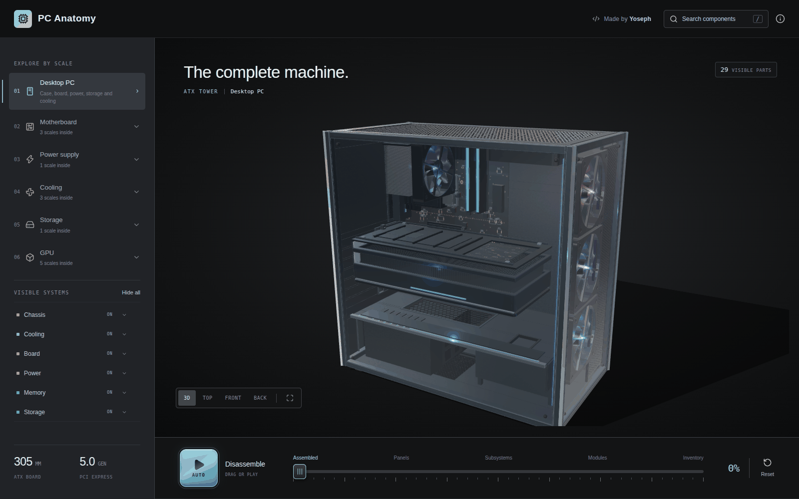
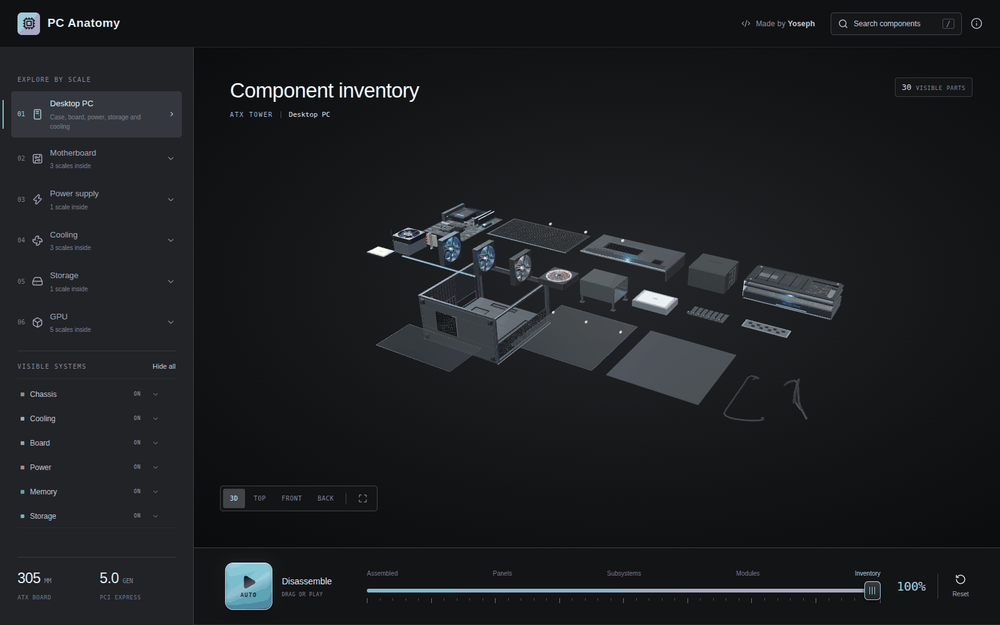
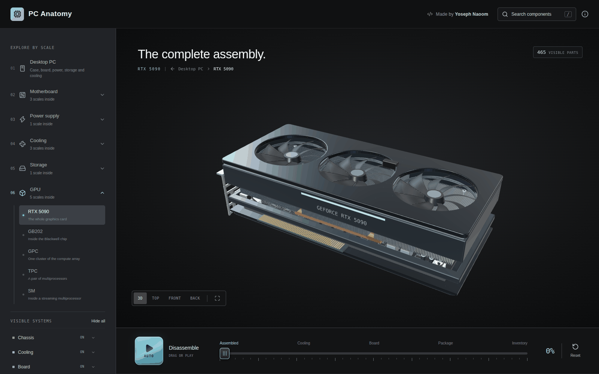
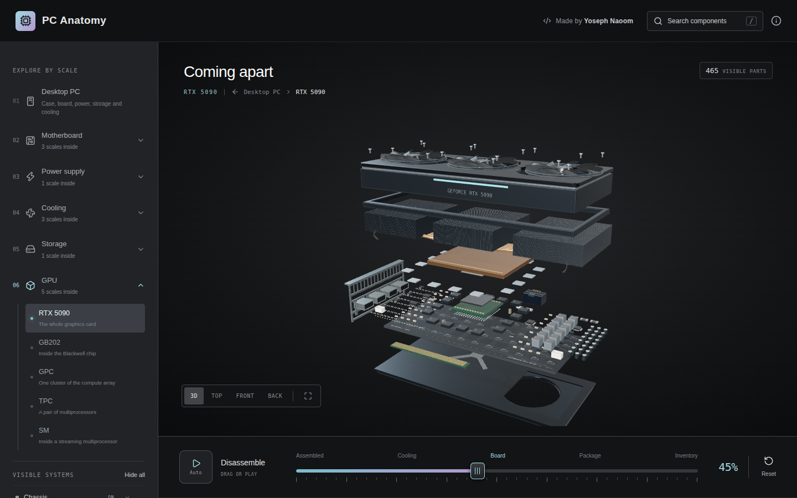
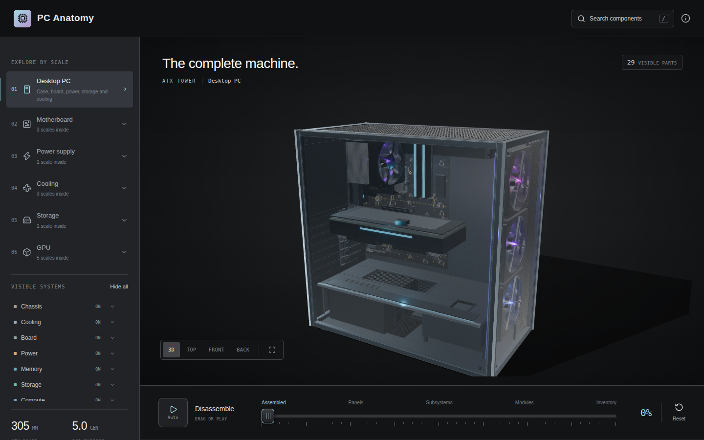
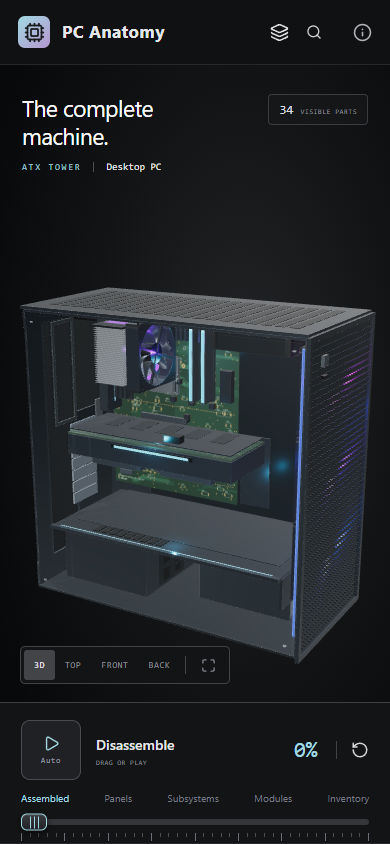
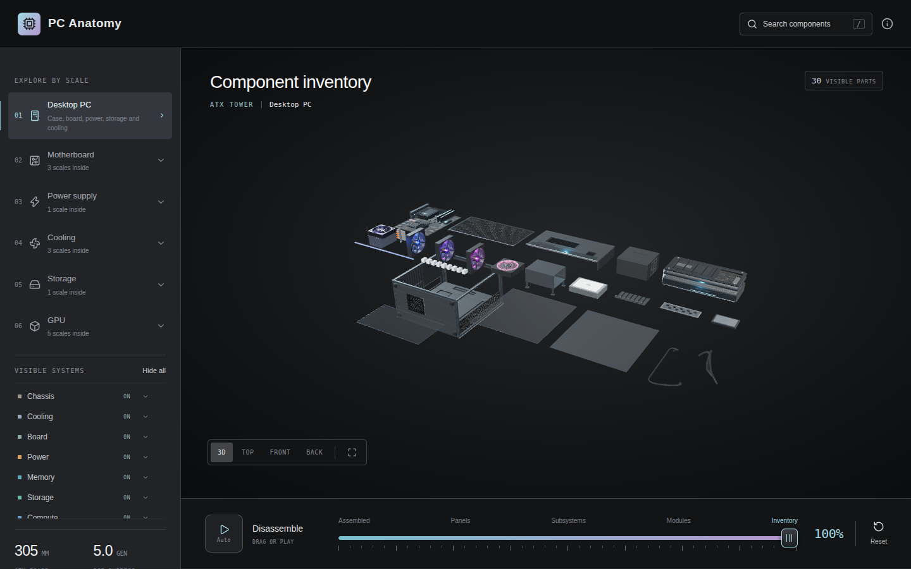

# PC Anatomy

PC Anatomy is an open-source 3D explorer that takes a desktop computer apart from the assembled ATX tower down to a single GPU streaming multiprocessor.

## [**Explore the live demo →**](https://pc-anatomy.com/)

Every polygon is generated in TypeScript with three.js. There are no imported models, image textures, or other runtime asset files. The roughly 300 selectable components each carry a name, a description, an explanation of their purpose, specifications, and citations instead of stopping at a label.



Press **Auto** at the left end of the bottom bar to watch the machine take itself apart, or drag the timeline to move through the sequence by hand.

## Scale tree

```text
Desktop PC
├── Motherboard
│   ├── Ryzen 9 9950X
│   │   └── Ryzen I/O die
│   └── Core Ultra 9 285K
│       └── Core Ultra I/O tile
├── Power supply
├── Cooling
│   ├── Case fan
│   ├── CPU cooler
│   └── Liquid cooling
├── SATA SSD
└── RTX 5090
    └── GB202 processor
        └── Graphics processing cluster (GPC)
            └── Texture processing cluster (TPC)
                └── Streaming multiprocessor (SM)
```

The slider moves each scale from its assembled state to a laid-out inventory. Search can jump directly to a component at any depth, while breadcrumbs and the scale navigator move back through the machine.



Descending into a part rebuilds it at its own scale with its own timeline, so the graphics card that was installed in the tower comes apart into its shroud, fans, fin banks, heat pipes, vapor chamber, board and backplate.





## The interface

The rail on the left carries the scale tree and per-system visibility. The bar along the bottom is the disassembly timeline, with the **Auto** key at its left-hand end, the named phases above the slider, and a reset on the right. Left-click an explorable component to open it; right-click to inspect it and use the detail, hide, isolate and focus controls. Hidden components remain available from the stage tracker until they are restored, the scale changes, or the explorer is reset. The corner expand control toggles browser fullscreen.

| Workbench                                                                                                              | On a phone                                                                                                                                               |
| ---------------------------------------------------------------------------------------------------------------------- | -------------------------------------------------------------------------------------------------------------------------------------------------------- |
|  |  |



## Quick start

PC Anatomy requires Node.js 22.13 or newer.

```bash
git clone https://github.com/Yoosseph/gpu_anatomy.git
cd gpu_anatomy
npm install
npm run dev
```

Vite prints the local development URL. To create and preview a production build:

```bash
npm run build
npm start
```

The project is entirely static. The production output is written to `dist/` and needs no backend.

## Search appearance

The public URL is `https://pc-anatomy.com/`. The HTML entry includes a canonical URL, descriptive title, social preview metadata, and WebSite / WebApplication structured data. `public/guide/index.html` is a readable hardware guide that works without JavaScript and links back to the explorer.

Deploy the entire `dist/` directory, including `guide/`, `robots.txt`, `sitemap.xml`, and the icon files. Serve `/guide/` from its own `index.html` before applying any single-page-app fallback. If the hostname changes, update the canonical and social URLs in both HTML pages, the structured data, and the sitemap and robots files together.

After deployment, submit `https://pc-anatomy.com/sitemap.xml` in Google Search Console and request indexing of the homepage and guide. Indexing, favicon display, and ranking are decided by Google and may take time after a recrawl. Do not add fabricated ratings or keyword stuffing.

The browser and search icons are derived from `public/favicon.svg`. Run `node scripts/generate-icons.mjs` to regenerate the PNG and multi-resolution ICO variants (uses Playwright and Microsoft Edge). `public/pc-assembled.png` is a capture of the actual model; `public/social-preview.png` is its sharing card.

## Project layout

| Path                         | Purpose                                                              |
| ---------------------------- | -------------------------------------------------------------------- |
| `index.html`, `app/main.tsx` | Vite entry point and React mount                                     |
| `app/page.tsx`               | Explorer interface, navigation, search, timeline, and detail panel   |
| `app/viewer.tsx`             | Canvas host and lazy scene loading                                   |
| `app/workbench.css`          | Desktop, responsive, and touch layout                                |
| `lib/scene.ts`               | Renderer, camera, picking, dive animation, and explode interpolation |
| `lib/levels.ts`              | Scale tree and per-scale presentation metadata                       |
| `lib/models.ts`              | Builder registry and shared geometry tools                           |
| `lib/concepts/*.ts`          | Written component catalogue, organized by subsystem                  |
| `lib/manifest.ts`            | Catalogue composition, search, and explorer state helpers            |
| `lib/*.ts` builder modules   | Code-generated geometry for each physical or logical scale           |
| `tests/*.test.ts`            | Data integrity, layout, picking, and geometry-presence tests         |
| `SOURCES.md`                 | Research and dimensional references                                  |

## Adding a component

A component joins the written catalogue to selectable geometry through its concept ID.

1. Add the concept to the relevant file in `lib/concepts/`. Follow a neighboring entry and provide its unique `id`, scale, parent, category, representation type, explanation, specifications, accuracy note, and source IDs.
2. In that scale's builder, create the geometry and pass the same concept ID to the shared `add` or `instances` helper. The helper supplies selection identity, explode placement, inventory layout, and counting.
3. Add any new references to `lib/sources.ts` and document them in `SOURCES.md`.
4. If the concept lives in a new catalogue file, export its array and compose it into `lib/manifest.ts`.
5. Run the checks below. The tests reject anonymous geometry, duplicate concept IDs, broken parent links, and scales with nothing to render.

Do not introduce delayed reveal thresholds for assembled geometry. A component that exists in the assembled product should exist at slider position zero and move continuously as the product comes apart.

## Adding a scale

A new scale has five integration points:

1. Add its ID and definition to `lib/levels.ts`, including its parent, kind, concept, phases, and navigation text.
2. Implement its geometry builder and register that builder in `lib/models.ts`.
3. Add its written catalogue in `lib/concepts/`.
4. Put `open: '<new-level-id>'` on the concept in the parent scale that leads into it.
5. Export and compose the new concepts in `lib/manifest.ts`.

The scale tree drives navigation, breadcrumbs, lighting, and the disassembly timeline. Avoid adding a second hand-written route table. When a model is rebuilt, `lib/scene.ts` must also clear its cached `layoutSignature` so the new inventory is packed from its own pieces.

## Accuracy and sources

The machine follows published ATX dimensions where those dimensions are standardized. Three products are named and modeled as specific subjects: the GeForce RTX 5090, AMD Ryzen 9 9950X, and Intel Core Ultra 9 285K. The rest is an illustrative desktop build that explains representative construction and relationships rather than reproducing a particular bill of materials.

Processor and GPU floorplans are explanatory diagrams of documented logical architecture. They are not semiconductor mask layouts and do not claim exact transistor-level placement. See [SOURCES.md](SOURCES.md) for standards, product documentation, architecture references, and the scope of each source.

Product and company names are used nominatively to identify the hardware being described. PC Anatomy is not affiliated with or endorsed by NVIDIA, AMD, Intel, or any other named company.

## Contributing

Issues and focused pull requests are welcome. Keep written claims cited, preserve the distinction between physical models and logical diagrams, and run the full local checks before opening a change:

```bash
npm run check
npm run lint
npm test
npm run build
```
## AI-assisted development

AI workflows were used as a tool during the development of PC Anatomy, including for coding, iteration, debugging, and documentation. The project direction, design decisions, integration, testing, and final implementation remain maintainer-controlled.

PC Anatomy is available under the [MIT License](LICENSE).
